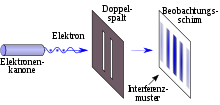
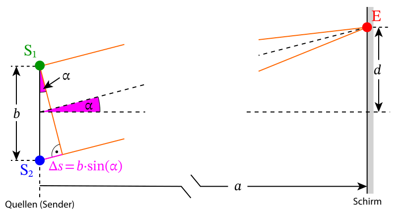

 # Doppelspalt   
Licht trifft auf zwei Spalte, wodurch an einem dahinterliegenden Schirm ein Interferenzmuster beobachtet werden kann.   
    
Licht kann (auch) als Welle betrachtet werden!   
→ Die Elementarwellen, die nach Huygens nach den Spalten entstehen, interferieren   
[Huygens&#39;sches Prinzip](huygenssches-prinzip_e.md)    
[Huygens&#39;sches Prinzip](huygenssches-prinzip_y.md)    
    
An dem Interferenzmuster am Schirm kann man sowohl Stellen erkennen, an denen die beiden Wellen aus den Spalten miteinander konstruktiv interferieren (Maxima), als auch Stellen, an denen sie destruktive interferieren (Minima).   
Der Gangunterschied zwischen den Wellen aus den zwei Spalten kann wie folgt bestimmt werden:   

$$
sin(\alpha)=\frac{\Delta s}{b}
$$
Wir betrachten nun die Maxima, für den Gangunterschied gilt hier:   

$$
\Delta s=k\cdot\lambda \rightarrow sin(\alpha)=\frac{k\cdot\lambda}{b}
$$
An der Abbildung erkennen wir noch einen Zusammenhang für den Winkel α:   

$$
tan(\alpha)=\frac{d}{a}
$$
Bei kleinen Winkeln kann die Kleinwinkelnäherung (sin **≈ **tan) benutzt werden:   

$$
\frac{k\cdot\lambda}{b}=\frac{d}{a}
$$
Ansonsten bestimmt man mithilfe des Pythagoras einen weiteren Sinus-Zusammenhang:   

$$
sin(\alpha)=\frac{d}{\sqrt{a^2\cdot d^2}}
$$
und setzt die beiden Zusammenhänge mit sin gleich!   
