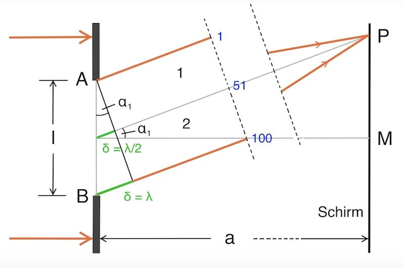
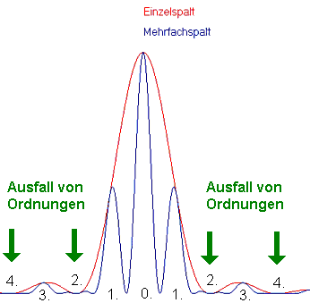

 # Einzelspalt   
Auch wenn Licht auf einzelnen Spalt trifft, kann man ein Interferenzmuster beobachten.   
    
Im Einzelspalt ist nach Huygens jeder Punkt der Wellenfront Quelle einer Elementarwelle. Wir unterteilen den Spalt nun bspw in 100 Elementarwellen und diese Elementarwellen nun nochmal in einen oberen und einen unteren Abschnitt.   
Haben die erste und die 100. Elementarwelle nun einen Gangunterschied von λ, so hat jede Elementarwelle im oberen Abschnitt eine Elementarwelle im unteren Abschnitt, zu der sie einen Gangunterschied von λ/2 hat, weshalb sie destruktiv interferieren. So interferiert bspw die 1. mit der 51., die 2. mit der 52. usw.   
Die Bedingung für destruktive Interferenz ändert sich deswegen:   

$$
\Delta s=k\cdot\lambda
$$
Ansonsten gelten die selben Zusammenhänge wie beim   
[Doppelspalt](doppelspalt.md)    
Der wichtige Unterschied ist, dass man mit dem Zusammenhang nun die Winkel bzw. Abstände zu Minimas erhält.   
   
 ## Einzelspalt beim Doppelspaltmuster   
    
Beim Interferenzmuster eines Doppelspalts kann man den Ausfall bestimmter Ordnungen beobachten. Obwohl dort eigentlich ein Maximum sein müsste, lässt sich dies nicht beobachten. Grund dafür ist, dass die beiden Spalte des Doppelspalts auch Einzelspalte sind und hier mit sich selbst destruktiv interferieren.   
