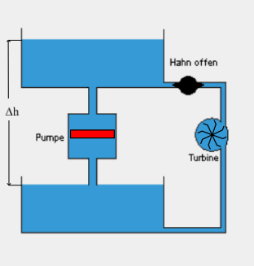

 # Elektrizitätslehre   
 ## Ladung und Strom   
    
$$
I = \frac{\Delta Q}{\Delta t}
$$   
$[I] = 1A(mpere)$  und $[Q] =1C(oulomb)$   
 ## Elektrische Spannung   
Als **Spannung** bezeichnet man die Fähigkeit einer elektrischen Quelle, in einem Stromkreis einen Strom aufrechtzuerhalten.   
Im Modell des offenen Wasserkreislaufs entspricht die Spannung dem Höhenunterschied der Vorratsbehälter:   
    
$$
⁍
$$   
$[U] = 1V(olt)$   
 ## Ohmscher Widerstand   
 ### Ohmsches Gesetz:   
$$
R=\frac{U}{I}
$$   
**konstanter Widerstand (R) bei konstanter Temperatur**   
 ## Leistung   
$$
\Delta E = U*I*\Delta t
$$   
$$
P=\frac{\Delta E}{\Delta t} = UI
$$   
