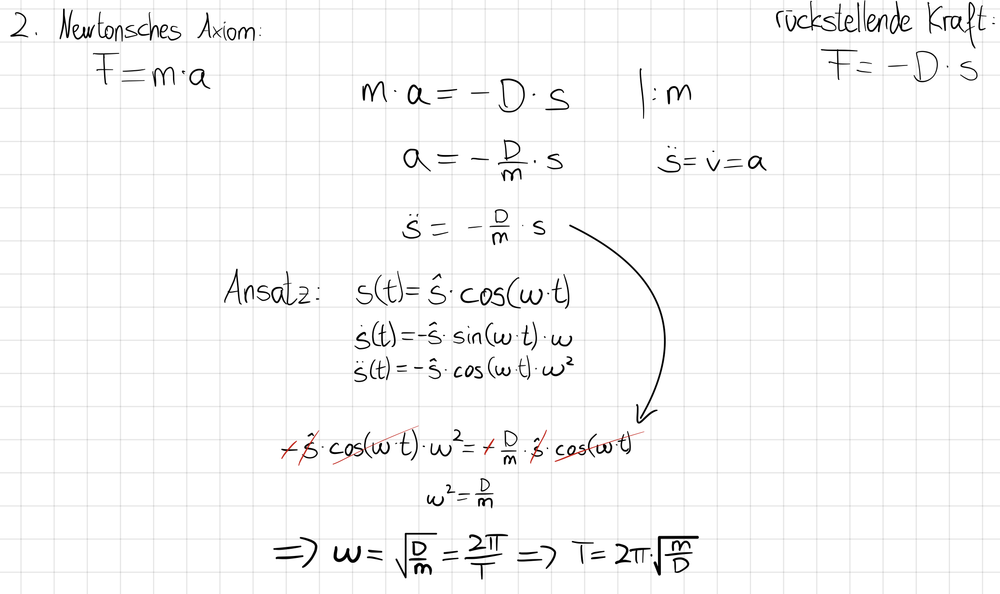

 # Federpendel   
Ein Federpendel mit einem Pendelkörper der Masse *m* und einer Feder mit der Federkonstante *D* schwingt harmonisch mit der Zeit-Ort-Funktion:   

$$
x(t)=\^x\cdot cos(\omega_0 \cdot t)
$$

$$
\omega_0 = \sqrt{\frac{D}{m}}
$$
Die Schwingungsdauer berechnet sich durch:   

$$
T=2\pi\cdot\sqrt{\frac{m}{D}}
$$
> Herleitung   

Idee: Die rückstellende Kraft (lineares Kraftgesetz) wird gleich dem 2. Axiom NEWTONs gesetzt.   
Das Pendel startet ausgelenkt → Kosinus.   
    
   
