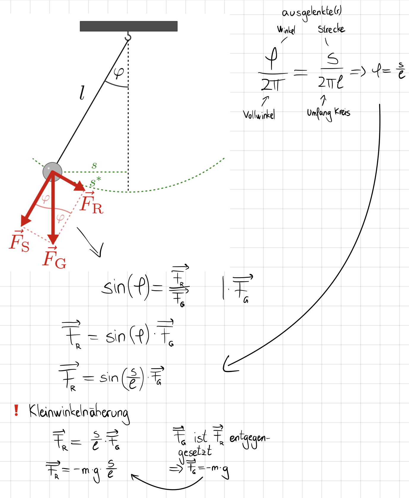

 # Fadenpendel   
Ein Fadenpendel mit einem Faden der Länge **l** schwingt bei kleinen Auslenkungen harmonisch mit der Zeit-Ort-Funktion:   

$$
x(t)=\^x\cdot cos(\omega_0 \cdot t)
$$

$$
\omega_0=\sqrt{\frac{g}{l}}
$$
Die Schwingungsdauer **T** berechet sich durch:   

$$
T=2\pi\cdot\sqrt{\frac{l}{g}}
$$
> Herleitung   

Idee: Die rückstellende Kraft (lineares Kraftgesetz) wird gleich dem 2. Axiom NEWTONs gesetzt.   
Bestimmung der rückstellenden Kraft:   
    
   
   
