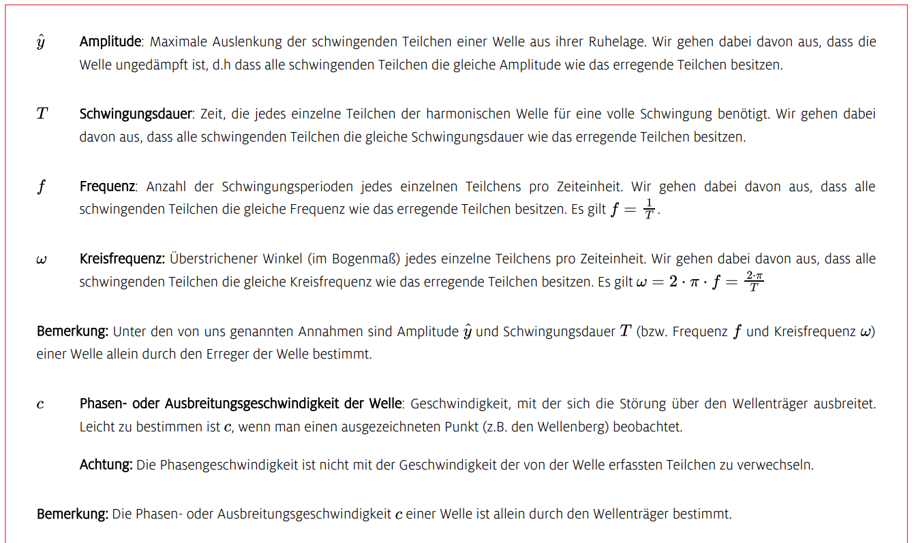

 # Mechanische Wellen   
[Mechanische Wellen \| LEIFIphysik](https://www.leifiphysik.de/mechanik/mechanische-wellen)    
Eine Welle ist eine räumliche und zeitliche Zustandsänderung physikalischer Größen, die meist nach bestimmten periodischen Gesetzmäßigkeiten erfolgt.   
Die Geschwindigkeit, mit der sich die Welle ausbreitet ist die Ausbreitungsgeschwindigkeit **c**    

$$
c=\lambda\cdot f
$$
> Transversalwellen   

Teilchen schwingen senkrecht zur Ausbreitungsrichtung   
> Longitudinalwellen   

Teilchen schwingen parallel zur Ausbreitungsrichtung   
> Größen zur Beschreibung einer Welle   

    
 ## Reflexion von Wellen   
 ### Reflexion am festen Ende   
 ### Reflexion am losen Ende   
- Wellenberg wird als Wellental reflektiert   
- Wellenberg wird als Wellenberg reflektiert   
- → Phasensprung   
- → kein Phasensprung   
[Huygens&#39;sches Prinzip](huygenssches-prinzip_y.md)    
   
 ## Wellenfunktion   
Die Wellenfunktion beschreibt die Auslenkung eines von der Welle erfassten Teilchens in y-Richtung nach einem beliebigen Ort *x* zu einem beliebigen Zeitpunkt *t:*   

$$
y(x;t)=\^y\cdot sin\left[2\pi\cdot\left(\frac{t}{T}-\frac{x}{\lambda}\right)\right]
$$
[Stehende Wellen](stehende-wellen.md)    
