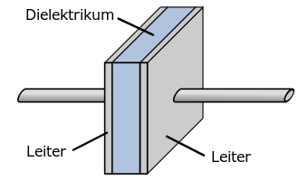
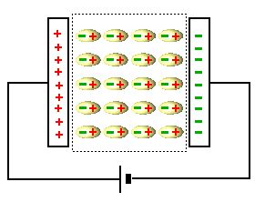

 # Kondensator   
    
 ## Kapazität   
- Versuch   
    [Spannung und Ladung beim Kondensator \| LEIFIphysik](https://www.leifiphysik.de/elektrizitaetslehre/kondensator-kapazitaet/versuche/spannung-und-ladung-beim-kondensator)    
   
Legt man eine Spannung an einen Kondensator an, so sammeln sich an der einen Platte Elektronen (negative Ladungen) und an der anderen Platte Protonen (positive Ladungen). Die Ladungen an den Platten nehmen mit der angelegten Spannung proportional zu:   

$$
Q\sim U
$$
Da die Anzahl an Ladungen auch von der Bauart des Kondensators abhängt, führt man als Proportionalitätsfaktor die Kapazität *C* ein:   

$$
Q=C\cdot U
$$
Die Kapazität gibt also an, wie viel Ladung *Q* bei einer angelegten Spannung *U* im Kondensator gespeichert ist:   

$$
C=\frac{Q}{U}
$$

$$
[C]=1\frac{C}{V}=1F(arad)
$$
 ### Kapazität eines Plattenkondensators:   

$$
C=\varepsilon_o\cdot\varepsilon_r\cdot\frac{A}{d}
$$
*A*: Fläche einer Platte   
*d*:  Abstand zwischen den Platten   
 ## Dielektrikum   
    
Führt man zwischen die Platten eines Kondensators einen Nichtleiter, so richten sich die im Nichtleiter befindlichen Moleküle bei angelegter Spannung im elektrischen Feld des Kondensators wie skizziert gegensätzlich zum elektrischen Feld aus. Hierdurch entsteht ein elektrisches Feld, welches dem ursprünglichen entgegengesetzt ist, wodurch das elektrische Feld des Kondensators abgeschwächt wird.   
⇒ Da das elektrische Feld nun schwächer ist, sinkt auch die die Spannung *U*. Da *Q* gleichbleibt, steigt die Kapazität *C* eines Kondensators durch ein Dielektrikum.   
 ## Energie im Kondensator   

$$
W=\frac{1}{2}\cdot C\cdot U²
$$
 ## Auf- und Entladen eines   
