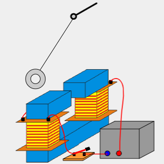

 # Wirbelstrombremse   
Ein Pendel wird beim Schwingen von einem Magnetfeld abgebremst.   
Waltenhofsches Pendel:   
    
Beim Eintauchen in das Magnetfeld des Elektromagneten ändert sich das Magnetfeld im Pendel, weshalb dort eine Spannung induziert wird. Der dort entstehende Strom ist nach Lenz seiner Ursache entgegengerichtet und erzeugt wiederum ein Magnetfeld. Das neue Magnetfeld ist hierbei dem Magnetfeld des Elektromagneten entgegengerichet. Das führt zum Abbremsen des Pendels.   
   
[Wirbelstrombremse.pdf](files/wirbelstrombremse.pdf)    
