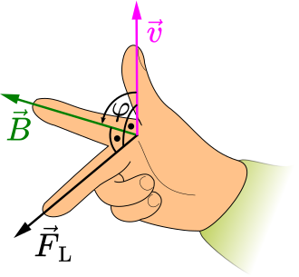
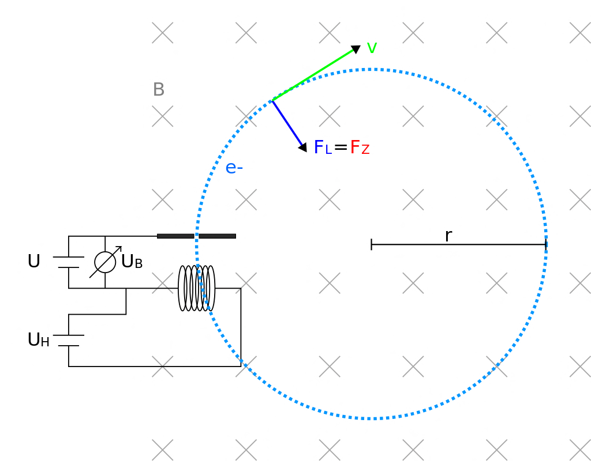

 # Magnetisches Feld   
 ## Magnetische Flussdichte   

$$
B=\frac{F}{I\cdot s}
$$
[B]=1T(esla)   
 ## Lorentzkraft   
Bewegt sich in einem magnetischen Feld *B* ein Teilchen mit der Ladung *q* und der Geschwindigkeit *v*, so erfährt dieses Teilchen die *Lorentzkraft*.   
    
- Die Richtung der Lorentzkraft kann mit den Drei-Finger-Regel bestimmt werden:   
    Für negative geladene Teilchen (physikalische Stromrichtung) benutzt man die linke Hand, für positiv geladene Teilchen (technische Stromrichtung) die rechte Hand.   
    Zeigt der Daumen in die Bewegungsrichtung eines Teilchens und der Zeigefinger in Magnetfeldrichtung, dann zeigt der Mittelfinger in Richtung der *Lorentzkraft*.   
   
Bewegt sich das Teilchen senkrecht zum Magnetfeld, dann gilt:   

$$
F_L=q\cdot v\cdot B
$$
- Ansonsten gibt φ den Winkel zwischen *B* und *v* an:   
    
$$
F_L=q\cdot v\cdot B\cdot sin(\varphi)
$$
[Schraubenbahn](herleitung-lorentzkraft.md)    
   
 ## Magnetfeld einer schlanken Spule   
[992magnetfeld\_einer\_spule\_zweite\_rechte\_hand\_regel\_1.svg](files/992magnetfeld_einer_spule_zweite_rechte_hand_reg.svg)    
Fließt durch eine lange Zylinderspule ein elektrischer Strom, so herrscht im **Innenraum** der Spule ein **homogenes magnetisches Feld**.   
**Magnetische Feldstärke**:   
$$
B=\mu\_0\frac{N}{l}I
$$   
$N$: Anzahl der Windungen   
$l$: Länge der Spule   
$I$: Stromstärke   
 ## $\frac{e}{m}$-Versuch   
    
- VA und VB   
     ### VA:   
    Ein Elektron wird in einem Magnetfeld emittiert und beschleunigt.   
     ### VB:   
    Das Elektron dreht sich im Kreis. Bei Veränderung der magnetischen Flussdichte durch Variation des Spulenstroms können wir eine Veränderung der Kreisbahn des Elektronenstrahls beobachten.   
   
 ### VD:   
Auf das Elektron wirkt zu jedem Zeitpunkt eine Lorentzkraft. Ihre Richtung ändert sich gemeinsam mit der Bewegungsrichtung des Elektrons ständig. Es entsteht eine Kreisbahn: Die Lorentzkraft wirkt als Zentripetalkraft.   
[Schraubenbahn](schraubenbahn.md)    
Mit den Messwerten aus dem Versuch erhalten wir für die Masse eines Elektrons:   
$$
m\_e=9,1110^{-31}kg
$$   
[Schraubenbahn](schraubenbahn_c.md)    
[Schraubenbahn](wienfilter-and-massenspektrometer.md)    
[Schraubenbahn](schraubenbahn_3.md)    
