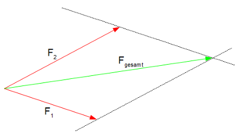

 # Mechanik   
 # Kinematik   
$$
⁍
$$   
gleichförmige Bewegung:                                         $s(t) =vt$                                 $v = \frac{\Delta x}{\Delta t}$   
gleichförmig beschleunigte Bewegung:                    $s(t) = \frac{1}{2}at²$                                 $v=at$   
 # Dynamik   
 ### Trägheitsgesetz (1. Newtonsches Gesetz):   
 ### 2. Newtonsches Gesetz:   
$$
\vec F=m\vec a
$$   
$[F] = 1kg\frac{m}{s²}=1N$   
    
 ### Wechselwirkungsprinzip: actio=reactio (3. Newtonsches Gesetz)   
Übt ein Körper eine Kraft auf einen anderen Körper aus, so übt der andere Körper eine andere Kraft auf den ursprünglichen Körper aus.   
Die Beträge dieser Kräfte sind gleich, ihre Richtung ist aber entgegengesetzt.   
 ### Kreisbewegung   
