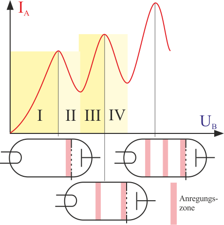

 # Franck-Hertz-Versuch   
[FRANCK-HERTZ-Versuch \| LEIFIphysik](https://www.leifiphysik.de/atomphysik/atomarer-energieaustausch/versuche/franck-hertz-versuch)    
    
    
- Versuchsaufbau   
     ## VB:   
    Man regelt langsam die Beschleunigungsspannung $U\_b$ hoch und beobachtet den Strom $I\_a$, der die Anode erreicht. Das Ergebnis zeigt diese Abbildung:   
     ### Bereich I:   
    Je höher die Beschleunigungsspannung, desto mehr Elektronen bekommen genug Energie, um die Anode zu erreichen und desto größer ist der Strom.   
     ### Bereich II:   
    Da die Elektronen eine bestimmte kinetische Energie durch die Beschleunigungsspannung erhalten haben, regen einige das Quecksilbergas an und verlieren ihre Energie. Sie schaffen es anschließend nicht mehr, die Anode zu erreichen und der Strom sinkt auf ein lokales Minimum.   
     ### Bereich III:   
    Die Beschleunigungsspannung steigt weiter an, sodass die kinetische Energie, die die Elektronen nach dem Anregen des Gases bekommen ausreicht, damit sie die Anode wieder erreichen.   
     ### Bereich IV:   
    Die Elektronen haben nach dem ersten Anregen genügend Energie, um das Gas ein zweites Mal anzuregen, wodurch sie erneut ihre Energie verlieren.   
   
 ### Resultat des Versuchs:   
- Jedes Atom besitzt ein spezifisches Energieniveau - Energien, die darunter liegen, können es nicht anregen   
- von einem angeregten Energieniveau gehen die Atome durch Emission vom Licht (Photonen) wieder in den ursprünglichen Zustand zurück   
[Absorption eines Photons durch ein Atom](absorption-eines-photons-durch-ein-atom.md)    
   
 ### Ergänzung:   
Wir haben nun herausgefunden, dass sowohl Photonen ein Atom anregen können (Photoeffekt) als auch Elektronen.   
***Unterschied zwischen diesen beiden Formen der Anregung:***   
- Beim Anregen durch Photonen muss die Energie des Photons ($E=\frac{h}{f}$) genau gleich der Energiedifferenz im Atom sein.   
- Beim Anregen durch Elektronen kann die Energie der Elektronen auch größer als die Energiedifferenz des Atoms sein.   
[Absorption eines Photons durch ein Atom](potentialtopf.md)    
