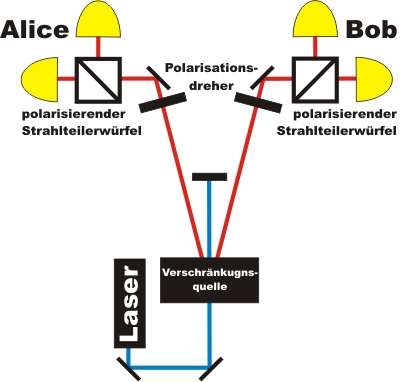
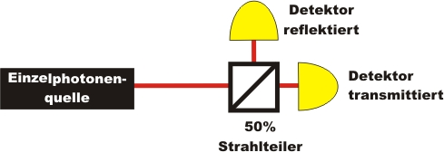
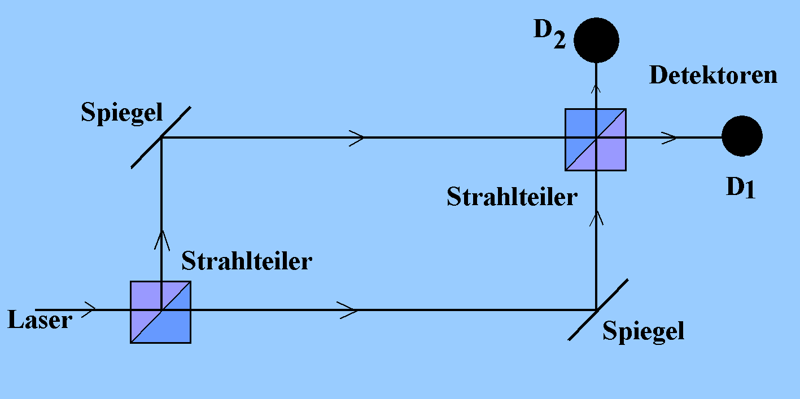
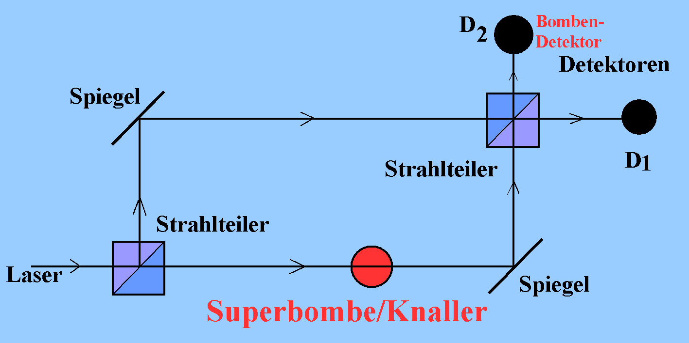

 # Moderne Experimente   
- Verschlüsselung   
    **Wie erfolgt die binäre Informationsübertragung?**   
    - durch Polarisation einzelner Photonen   
    - 0 = linear horizontal polarisiertes Photon   
    - 1 = linear vertikal polarisiertes Photon   
   
    **Eine durch Quantenkryptographie übertragene Information kann nicht abgehört werden, da das Abhören die Information verändern würde**   
    
- Verschränkung   
    Ein Photonenpaar wird mit einem Laser und zwei Kristallen erzeugt. Dieses verschränkte Photonenpaar ist auf eine bestimmte Weise miteinander verbunden   
    
- Unteilbarkeit   
    Das Photon kommt immer nur bei einem der beiden Detektoren an ⇒ Es ist unteilbar   
- Kollaps der Wellenfunktion   
    - erfolgt instantan   
    - nicht-lokal (impliziert Fernwirkungen)   
    
- Mach-Zehnder-Interferometer   
     ### VB:   
    D1 weist immer Teilchen nach, D2 nie   
     ### VD:   
    D2: Auf einem Weg findet beidesmal keine Reflexion statt, auf dem anderen Weg zweimal. Dadurch entsteht ein Gangunterschied, der zu destruktiver Interferenz führt, weshalb D2 nie “anspringt”   
    D1: Auf beiden Wegen findet je einmal Reflexion und einmal Durchgang statt. Hier kommt es also zu konstruktiver Interferenz.   
    Da wir Interferenz sogar beobachten können, wenn wir nur ein einziges Photon in das Interferometer schicken, ist klar, dass das Photon nicht nur einen Weg geht. Stellt man sich die Frage, welchen Weg das Photon genommen hat, so wird man keine Interferenz mehr beobachten können.   
    
- Knallertest   
    Wird in ein Mach-Zehnder-Interferometer nun eine Bombe so gelegt, dass sie einen Arm blockiert, so blockiert diese Bombe den unteren Weg. Da das Photon im unteren Weg nach der Bombe nicht mehr weiterkommt, kann es auch nicht mehr zu Interferenz kommen. Die Wahrscheinlichkeit, dass D1 anspringt beträgt nun also 25%, für D2 aber auch 25%.   
