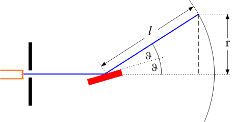

 # Elektronenbeugung und De Broglie   
[Elektronenbeugungsröhre \| LEIFIphysik](https://www.leifiphysik.de/quantenphysik/quantenobjekt-elektron/versuche/elektronenbeugungsroehre)    
- Versuch Elektronenbeugungsröhre   
     ## Versuchsaufbau:   
    [8083](http://lp.uni-goettingen.de/get/image/8083)    
    Elektronen werden aus einer Glühwendel emittiert und über eine Spannung beschleunigt. Anschließend treffen sie auf eine Graphitfolie und werden von einem Leuchtschirm “sichtbar gemacht”   
     ## Versuchsbeobachtung:   
    - ein ringförmiges Interferenzmuster entsteht   
    - Je größer die Beschleunigungsspannung, desto kleiner die Ringradien   
   
     ## Versuchsdeutung:   
    Auch Elektronen verhalten sich manchmal wie Wellen (erzeugen Interferenzmuster)   
    
- Beweis $\lambda = \frac{h}{p}$   
    $$
sin(2\vartheta) = \frac{r}{l}
$$   
    Mit der Näherung $sin(2\vartheta)\approx 2sin(\vartheta)$ ergibt sich:   
    $$
2sin(\vartheta) = \frac{r}{l}
$$   
    Die Bragg-Beziehung $2sin(\vartheta)*d=k*\lambda$ führt zu:   
    $$
2*sin(\vartheta)=\frac{k*\lambda}{d}
$$   
    Wobei $\vartheta$ dem Glanzwinkel in Abhängigkeit von k und d dem Gitterabstand entspricht.   
    Mit $k=1$ und gleichsetzen der beiden Zusammenhänge ergibt sich:   
    $$
\frac{r}{l}=\frac{\lambda}{d}
$$   
    $$
\lambda = \frac{rd}{l}
$$   
    Mit diesem Zusammenhang kann nun im Elektronenbeugungsröhrenversuch die Wellenlänge der Elektronen in Abhängigkeit von r (Abstand zum 1. Minimum), d (Netzebenenabstand) und l (Abstand Graphitfolie zu Schirm) bestimmt werden.   
     ### Beweis von De Broglies Ansatz:   
    $$
\lambda = \frac{h}{p}
$$   
    Mit $p = mv$ und $E\_{kin}=\frac{1}{2}mv²$ sowie $E=eU$ folgt:   
    $$
\lambda = \frac{h}{\sqrt{2*m\_e*eU}}
$$   
    Die aus dem Versuch gewonnen Messwerte gelangen mit beiden Formeln zu ähnlichen Wellenlängen, wodurch De Broglies Ansatz experimentell bewiesen wurde.   
   
 ### Elektronen und andere Quantenobjekte am Doppelspalt:   
[Quantenobjekte \| LEIFIphysik](https://www.leifiphysik.de/quantenphysik/quantenobjekt-elektron/grundwissen/quantenobjekte)    
