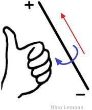
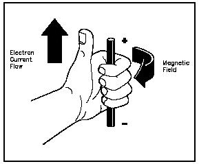
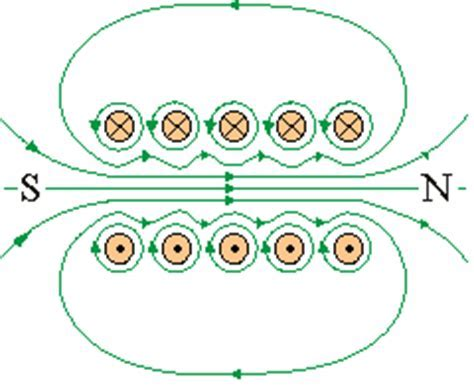
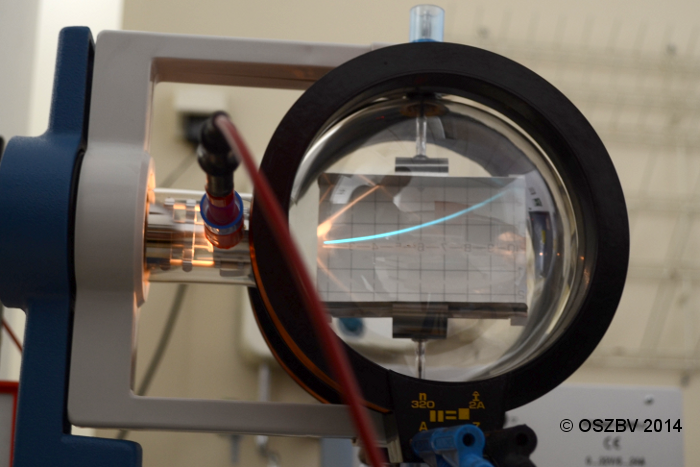
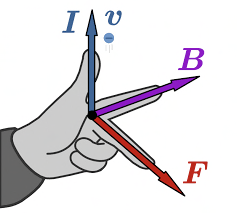

 # Präsentation Magnetfeld   
 # Erzeugung von Magnetfeldern   
 --- 
Elektrische Ströme (elektrische Ladungen bewegen sich) erzeugen ein Magnetfeld.   
Mehrere elektrische Ströme üben aufeinander Kräfte aus: **magnetische Kräfte**   
 # Magnetfeld eines geraden Leiters (nicht abi-relevant)   
 --- 
[992magnetfeld\_eines\_geraden\_leiters\_erste\_rechte\_hand\_regel.svg](files/992magnetfeld_eines_geraden_leiters_erste_rechte.svg)    
    
    
Für die magnetische Flussdicht $B$ gilt hier:   
$$
B=\mu\_0\frac{1}{2\pir}I
$$   
Aufgabe:   
[pdfresizer.com-pdf-crop.pdf](files/pdfresizer-com-pdf-crop.pdf)    
 # Zylinderspule   
 --- 
    
Jeder Draht erzeugt ein Magnetfeld.   
In der Spule überlagern sich die Magnetfelder der einzelnen Windungen.   
[992magnetfeld\_einer\_spule\_zweite\_rechte\_hand\_regel\_1.svg](files/992magnetfeld_einer_spule_zweite_rechte_hand_reg.svg)    
Im Innenraum der Spule herrscht ein **homogenes magnetisches Feld**   
$$
B=\mu\_0\frac{N}{l}I
$$   
Permeabilitätszahl $\mu\_r$:   
$\mu\_r$ gibt den Faktor an, um den sich die magnetische Flussdichte im Innern einer Spule vergrößert, wenn das Innere der Spule mit einem zugehörigen Stoff komplett gefüllt ist. Bsp: Eisenkern   
[Magnetfeld einer Zylinderspule \| LEIFIphysik](https://www.leifiphysik.de/elektrizitaetslehre/stroeme-magnetisches-feld/grundwissen/magnetfeld-einer-zylinderspule#aufgaben)    
 # Leiterschaukelversuch   
 --- 
[Leiterschaukelversuch.ogv.360p.vp9.webm](files/leiterschaukelversuch-ogv-360p-vp9.webm)    
VD: Auf einen stromführenden Leiter, der sich in einem Magnetfeld befindet, wirkt eine Kraft.   
Proportionalitäten:   
$F \sim I$ und $F \sim s$ (Leiterlänge)   
Vermutung: Ladungsträger erfahren im Magnetfeld eine Kraft   
$F=I*B*s$   
(FIBs)   
 # Lorentzkraft   
 --- 
**Versuch:**   
Elektronenstrahl im homogenen Magnetfeld eines Helmholtzspulenpaars   
    
VB: Der Elektronenstrahl wird abgelenkt   
VD: Geladene Teilchen, die sich in einem Magnetfeld senkrecht zu den Feldlinien bewegen, erfahren eine Kraft: die **Lorentzkraft**   
Mit $I=\frac{Q}{t}$ und $F=I*B*s$ folgt:   
$F=\frac{Q}{t}*B*s$   
Mit $v=\frac{s}{t}$ folgt:   
$$
F=Q*v*B
$$   
und für Elektronen mit $Q = e$:   
$$
F\_L=e*v*B
$$   
Ist v nicht senkrecht zum Magnetfeld, so gilt:   
$$
F=Q*v*Bsin(\varphi)
$$   
wobei $\varphi$  dem Winkel zwischen $\vec v$ und $\vec B$ entspricht   
 ## Linke Hand Regel:   
    
[992bestimmung\_der\_lorentz\_kraft\_drei-finger-regel\_der\_rechten\_hand\_0.svg](files/992bestimmung_der_lorentz_kraft_drei-finger-rege.svg)    
 # Fadenstrahlrohr ($\frac{e}{m}$)   
 --- 
[signal-2022-03-03-164459.png](files/signal-2022-03-03-164459.png)    
- VA und VB   
     ### VA:   
    Ein Elektron wird in einem Magnetfeld emittiert und beschleunigt.   
     ### VB:   
    Das Elektron dreht sich im Kreis. Bei Veränderung der magnetischen Flussdichte durch Variation des Spulenstroms können wir eine Veränderung der Kreisbahn des Elektronenstrahls beobachten.   
   
 ### VD:   
Auf das Elektron wirkt zu jedem Zeitpunkt eine Lorentzkraft. Ihre Richtung ändert sich gemeinsam mit der Bewegungsrichtung des Elektrons ständig. Es entsteht eine Kreisbahn: Die Lorentzkraft wirkt als Zentripetalkraft.   
Mit den Messwerten aus dem Versuch erhalten wir für die Masse eines Elektrons:   
$$
m\_e=9,1110^{-31}kg
$$   
