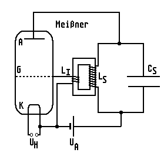
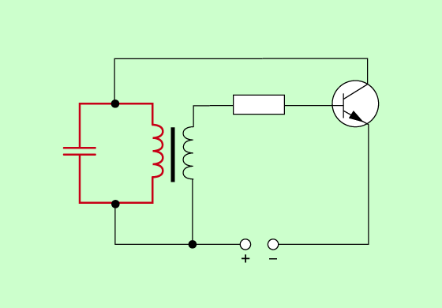

 # Rückkopplungsschaltung   
Problem: Schwingungen in realem Schwingkreis klingen mit der Zeit ab, da Energie durch Wärme "verloren geht".    
Um dieses Problem zu lösen, muss dem Schwingkreis im richtigen Moment Energie zugeführt werden.    
Meissner'sche Rückkopplungsschaltung:   
    
    
   
