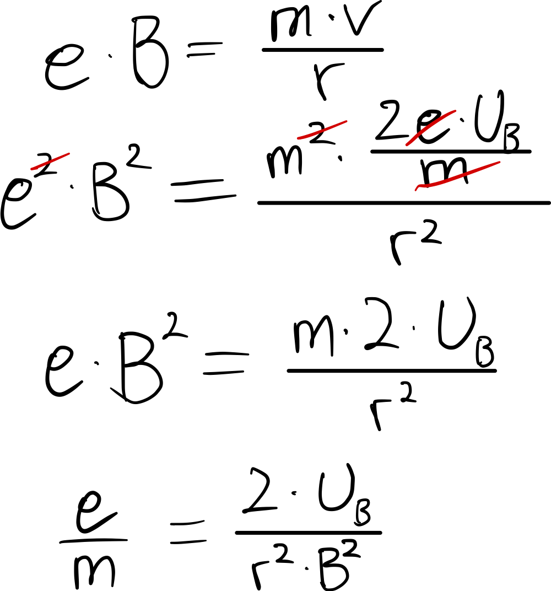

 # Herleitung   
$F\_L=e*v*B$   
$F\_Z =\frac{mv^2}{r}$   
$$
F\_L\stackrel{!}{=}F\_Z
$$   
$$
e*v*B=\frac{mv^2}{r}
$$   
$$
e*B=\frac{m*v}{r}
$$   
- $W\_{kin}\stackrel{!}{=}W\_{el}$   
    $$
e*U=\frac{1}{2}m*v²
$$   
    ...   
   
$$
v=\sqrt{\frac{2*e*U}{m}}
$$   
    
