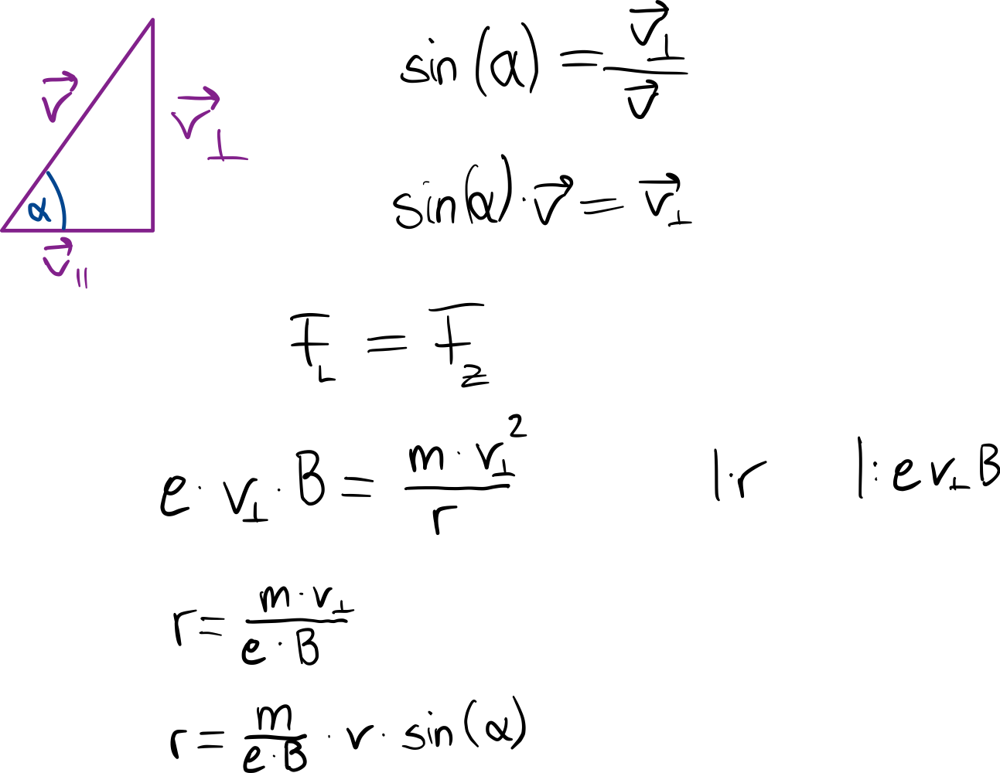

 # Schraubenbahn   
[Geladene Teilchen im magnetischen Feld (schräger Eintritt) \| LEIFIphysik](https://www.leifiphysik.de/elektrizitaetslehre/bewegte-ladungen-feldern/grundwissen/geladene-teilchen-im-magnetischen-feld-schraeger-eintritt)    
Elektronen treten schräg in ein Magnetfeld ein:   
- Bewegung unterteilen:   
    - Senkrecht zum B-Feld (Lorentzkraft)   
    - Nicht senkrecht zum B-Feld (keine Lorentzkraft)   
   
⇒ Schraubenbahn   
    
- Herleitung   
   
 ### Umlaufdauer T für einen Schraubenumlauf:   
$$
T = \frac{2\cdot \pi \cdot m}{e\cdot B}
$$   
 ### Ganghöhe h:   
$$
h=\frac{2\cdot \pi \cdot m\cdot v}{e\cdot B}\cdot cos(\alpha)
$$   
