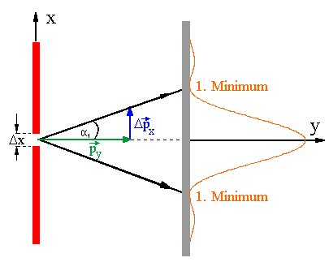

 # Unbestimmtheitsrelation   
[Unschärferelation \| LEIFIphysik](https://www.leifiphysik.de/quantenphysik/quantenobjekt-elektron/grundwissen/unschaerferelation)    
    
- Orts-Impuls-Unschärfe:   
    $$
\Delta x  \Delta p\_x \geq \frac{h}{4\pi}
$$   
    Ort und Impuls können nicht gleichzeitig genau gemessen werden. Je genauer $\Delta x$ gemessen wird, desto ungenauer $\Delta p\_x$ und umgekehrt.   
    - Ungefähre Herleitung   
         ### Einzelspalt   
        Formel für k-tes Minimum:   
        $sin(\alpha \_k)=\frac{k\lambda}{\Delta x}$ ⇒ 1. Minimum ⇒ k=1 ⇒ $sin(\alpha \_1)=\frac{\lambda}{\Delta x}$   
        Aus der obigen Abbildung ergibt sich:   
        $tan(\alpha \_1)=\frac{\Delta p\_x}{p\_y}$   
        Wir benutzen die Kleinwinkelnäherung ($sin(\alpha)\approx tan(\alpha)$) woraus folgt:   
        $$
\frac{\lambda}{\Delta x} = \frac{\Delta p\_x}{p\_y}
$$   
        Durch Umformen erhalten wir:   
        $$
\lambda  p\_y = \Delta p\_x  \Delta x
$$   
        Mit dem Zusammenhang für die De Broglie Wellenlänge $\lambda = \frac{h}{p\_y}$ folgt mit Kürzen:   
        $$
h=\Delta p\_x  \Delta x
$$   
- Energie-Zeit-Unschärfe:   
    $$
\Delta E\Delta t \geq \frac{h}{4\pi}
$$   
    wobei $\Delta E$ die Energie des betrachteten Teilchens und $\Delta t$ die Dauer eines Vorgangs oder Zustandes   
    Bsp: Ein Elektron in einem höheren Energieniveau, wo es sich über einen gewissen Zeitraum aufhält.   
